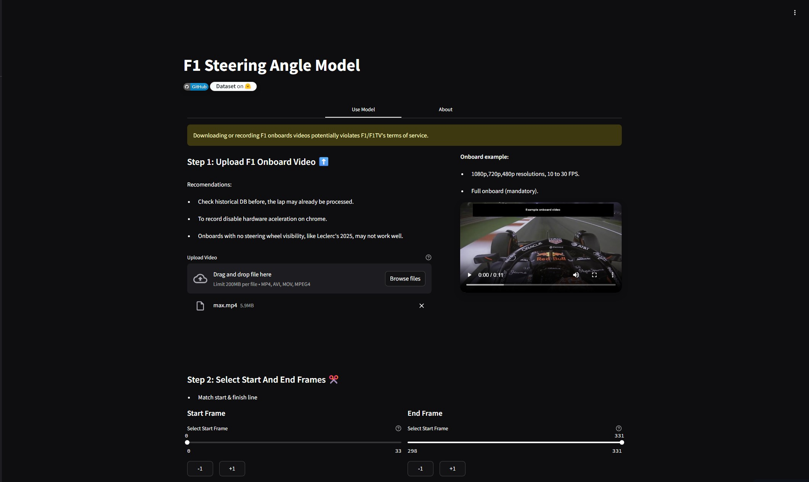
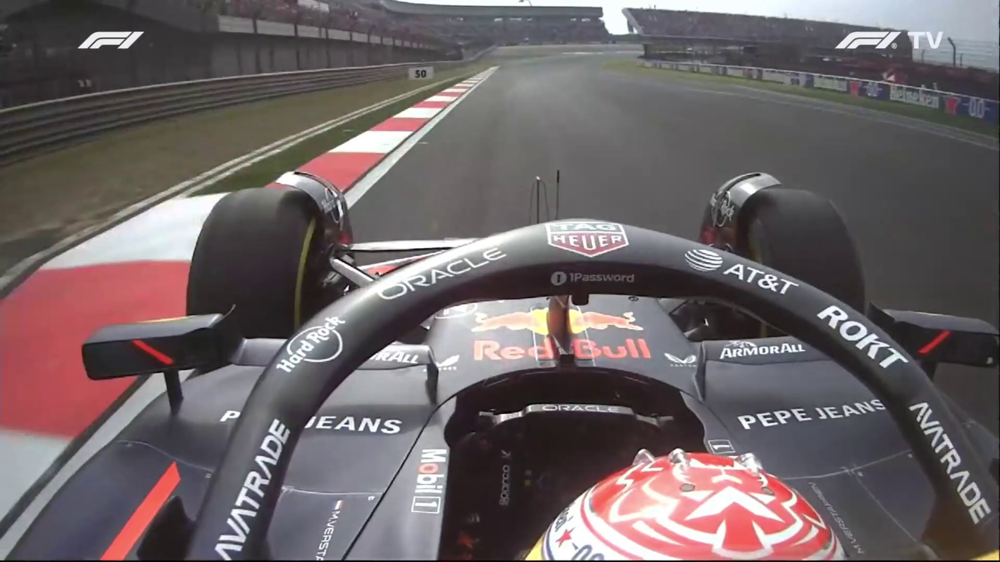
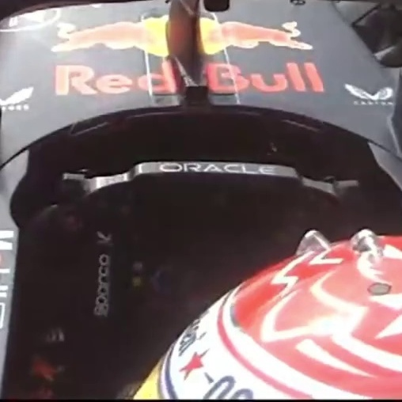
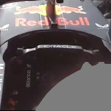
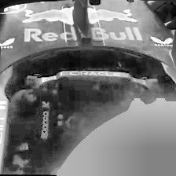
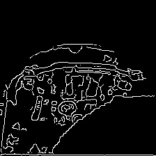

[](https://github.com/danielsaed/F1-steering-angle-model) 
[](https://huggingface.co/datasets/daniel-saed/F1-steering-angle-dataset)
[](https://opensource.org/licenses/MIT)


A machine learning application that predicts steering angles from F1 onboard camera footage.

[](https://f1-steering-angle-model.streamlit.app/)
[](https://daniel-saed-f1-steering-angle-model.hf.space)

<p align="center">
    
</p>

## About the Project

Steering input is one of the key fundamental insights into driving behavior, performance and style. However, there is no straightforward public source, tool or API to access steering angle data. The only available source is onboard camera footage, which comes with its own limitations, such as camera position, shadows, weather conditions, and lighting.

- The **F1 Steering Angle Prediction Model** uses a CNN based on EfficientNet-B0 to predict steering angles from a F1 onboard camera footage, trained with over 25,000 images (7000 manual labaled augmented to 25000) and YOLOv8-seg nano for helmets segmentation, allowing the model to be more robust by erasing helmet designs.
        
- Currentlly the model is able to predict steering angles from 180° to -180° with a 3°-5° of error on ideal contitions.

- EfficientNet-B0 and YOLOv8-seg nano are exported to ONNX format, and images are resized to 224x224 allowing it to run on low-end devices.
                    

#####
## How It Works

##### Video Processing: 
- From the onboard camera video, the frames selected are extracted at the FPS rate.
            
##### Image Preprocessing:
- The frames are cropeed based on selected crop type to focus on the steering wheel and driver area.
- YOLOv8-seg nano is applied to the cropped images to segment the helmet, removing designs and logos.
- Convert cropped images to grayscale and apply CLAHE to enhance visibility.
- Apply adaptive Canny edge detection to extract edges, helped with preprocessing techniques like bilateralFilter and morphological transformations.

##### Prediction: 
- The CNN model processes the edge image to predict the steering angle
            
##### Postprocessing
- apply local a trend-based outlier correction algorithm to detect and correct outliers
            
##### Results Visualization
- Angles are displayed as a line chart with statistical analysis also a csv file with the frame number, time and the steering angle.
#####

</br>
<!-- Original image -->
<p align="center">
  <strong>Original Onboard Frame</strong>
</p>
<p align="center">
  
</p>

<!-- Preprocessed images row -->
<p align="center">
  <strong>Preprocessed Images</strong>
</p>
<p align="center">
  
  
  
  
</p>

<p align="center">
  <em>Left to right: Cropped image, Yolo segmentation, CLAHE enhanced image, Edge detection result</em>
</p>
</br>


### Performance Analysis

After extensive development, the model has achieved the following performance metrics:
- From 0 to ±90° = 3° of ground truth
- From ±90° to ±180° = 5° of ground truth

**Limitations**: Performance may decrease in:
- Low visibility conditions (rain, extreme shadows)
- Low quality videos (low resolution, high compression)
- Changed camera positions (different angle, height)

</br>

## Installation and Usage

### Prerequisites
- Python 3.11 
- requirements.txt dependencies

### Option 1: Use the Hosted Version
The simplest way to use the application is through the [hosted Streamlit app](https://f1-steering-angle-model.streamlit.app/).

### Option 2: Run Locally

1. **Clone the repository**
   ```bash
   git clone https://github.com/danielsaed/F1-machine-learning-webapp.git
   cd F1-machine-learning-webapp
   ```

2. **Install dependencies**
   ```bash
   # For Linux/macOS, install OpenCV system dependencies
   sudo apt update
   sudo apt install -y libgl1-mesa-glx
   
   # Install Python dependencies
   pip install -r requirements.txt
   ```

3. **Run the application**
   ```bash
   streamlit run streamlit_app.py
   ```

4. **Open in browser**  
   The application will be available at http://localhost:8501


### Option 3: Download the Standalone App (Windows)

1. **Go to the [Releases page](https://github.com/danielsaed/F1-machine-learning-webapp/releases) of this repository.**
2. **Download the latest `.exe` file** (e.g., `F1SteeringApp.exe`) from the Assets section.
3. **(Optional) Place your `.env` file** in the same folder as the `.exe` if you need custom environment variables.
4. **Double-click the `.exe` to launch the app.**
5. The app will open in your default browser.

---

### Option 4: Run with Docker

#### a) Using the pre-built Docker image

1. **Install [Docker](https://docs.docker.com/get-docker/) if you don't have it.**
2. **Run the following command:**
   ```bash
   docker run -p 8501:8501 danielsaed99/f1-steering-angle
   ```
3. **Open your browser at** [http://localhost:8501](http://localhost:8501)

#### b) Build and run from the Dockerfile

1. **Clone the repository**
   ```bash
   git clone https://github.com/danielsaed/F1-machine-learning-webapp.git
   cd F1-machine-learning-webapp
   ```

2. **Build the Docker image**
   ```bash
   docker build -t f1-steering-angle .
   ```

3. **Run the container**
   ```bash
   docker run -p 8501:8501 f1-steering-angle
   ```

4. **Open your browser at** [http://localhost:8501](http://localhost:8501)


## Contributing

Any contributions to improve the model or application are welcome.

## License

This project is licensed under the MIT License - see the [LICENSE](LICENSE) file for details.

## Disclaimer
Downloading or recording F1 onboards videos potentially violates F1/F1TV's terms of service.

This model is for research/educational purposes only. It is not related to F1 or any other organization.

