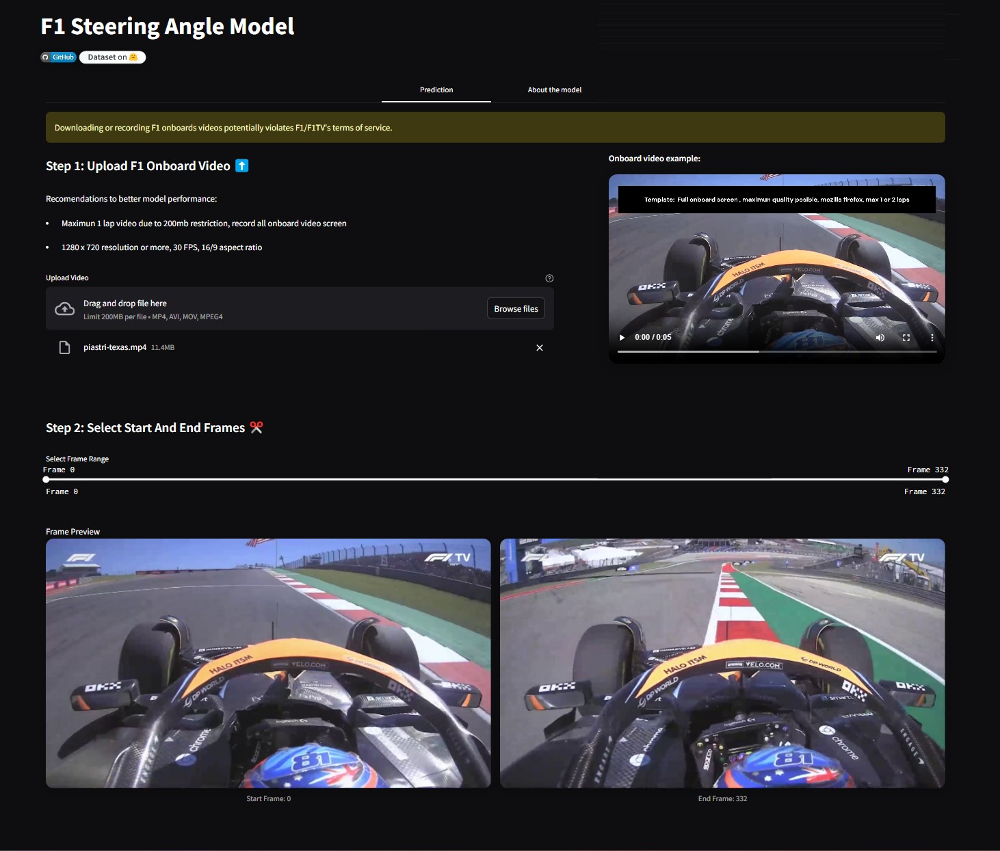
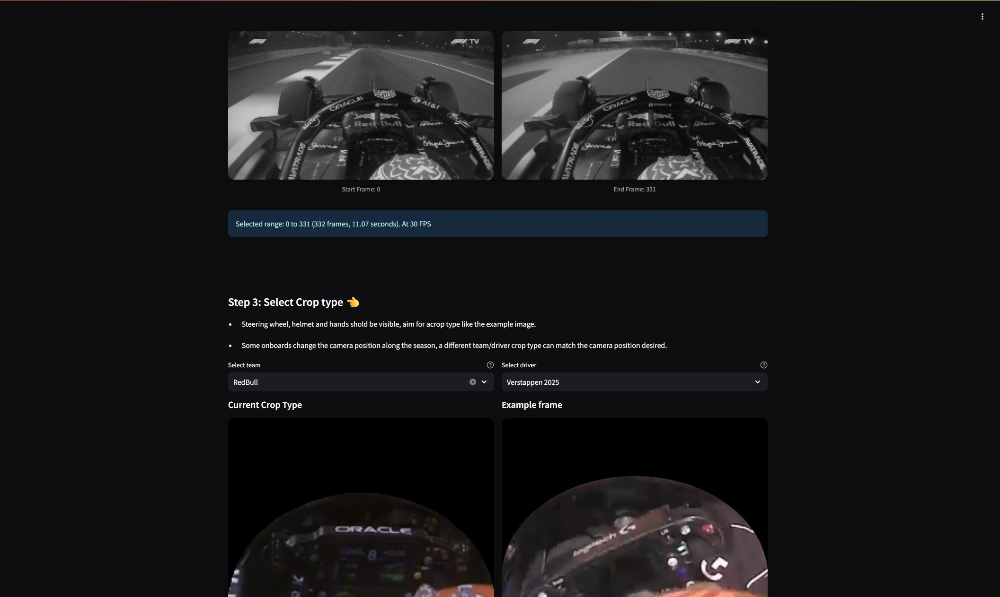

# F1 Steering Angle Model

[](https://github.com/danielsaed/F1-steering-angle-model) 
[](https://huggingface.co/datasets/daniel-saed/f1-steering-angle)
[](https://f1-steering-angle.streamlit.app/)
[](https://opensource.org/licenses/MIT)

A machine learning application that predicts steering angles from F1 onboard camera footage.

https://f1-steering-angle.streamlit.app/

<p align="center">
    
    
</p>

## About the Project

Steering input is one of the key fundamental insights into driving behavior, performance and style. However, there is no straightforward public source, tool or API to access steering angle data. The only available source is onboard camera footage, which comes with its own limitations, such as camera position, shadows, weather conditions, and lighting.

The **F1 Steering Angle Prediction Model** is a Convolutional Neural Network (CNN) based on EfficientNet-B0 with a regression head for angles from -180° to 180° to predict steering angles from F1 onboard camera footage (current generation F1 cars), trained with over 1500 manually annotated images.

## How It Works

1. **Video Processing**: From the onboard camera video, frames are extracted at your selected FPS rate
2. **Image Preprocessing**:
   - Cropping the image to focus on the track area
   - Applying CLAHE (Contrast Limited Adaptive Histogram Equalization) to enhance visibility
   - Edge detection to highlight track boundaries
3. **Neural Network Prediction**: A CNN model processes the edge image to predict the steering angle
4. **Postprocessing**: Apply a local trend-based outlier correction algorithm to detect and correct outliers
5. **Results Visualization**: Angles are displayed as a line chart with statistical analysis


### Model 

CNN based on EfficientNet-B0 with a regression head for angles from -180° to 180°

- **Input**: 224x224px grayscale edge-detected images
- **Backbone**: EfficientNet-B0 with a regression head
- **Output**: Steering angle prediction between -180° and +180° with a local trend-based outlier correction algorithm
- **Training data**: Over 1500+ manually annotated F1 onboard footage

### Image Processing

The preprocessing pipeline is critical for model performance:

1. **Grayscale Conversion**: Reduces input size and complexity
2. **Cropping**: Focuses on the track area for better predictions
3. **Adaptive CLAHE**: Dynamically adjusts contrast to maximize track features visibility
4. **Edge Detection**: Uses adaptive Canny edge detection targeting ~6% edge pixels per image
5. **Model Format**: ONNX format for cross-platform compatibility and faster inference
6. **Batch Processing**: Inference is done in batches for improved performance

</br>
<!-- Original image -->
<p align="center">
  <strong>Original Onboard Frame</strong>
</p>
<p align="center">
  
</p>

<!-- Preprocessed images row -->
<p align="center">
  <strong>Preprocessed Images</strong>
</p>
<p align="center">
  
  
  
</p>

<p align="center">
  <em>Left to right: Cropped image, CLAHE enhanced image, Edge detection result</em>
</p>
</br>


### Performance Analysis

After extensive development, the model has achieved the following performance metrics:
- From 0 to ±90° = 6° of ground truth
- From ±90° to ±180° = 13° of ground truth

**Limitations**: Performance may decrease in:
- Low visibility conditions (rain, extreme shadows)
- Low quality videos (low resolution, high compression)
- Changed camera positions (different angle, height)

</br>

## Installation and Usage

### Prerequisites
- Python 3.11 
- requirements.txt dependencies

### Option 1: Use the Hosted Version
The simplest way to use the application is through the [hosted Streamlit app](https://f1-steering-angle.streamlit.app/).

### Option 2: Run Locally

1. **Clone the repository**
   ```bash
   git clone https://github.com/danielsaed/F1-machine-learning-webapp.git
   cd F1-machine-learning-webapp
   ```

2. **Install dependencies**
   ```bash
   # For Linux/macOS, install OpenCV system dependencies
   sudo apt update
   sudo apt install -y libgl1-mesa-glx
   
   # Install Python dependencies
   pip install -r requirements.txt
   ```

3. **Run the application**
   ```bash
   streamlit run streamlit_app.py
   ```

4. **Open in browser**  
   The application will be available at http://localhost:8501


## Contributing

Any contributions to improve the model or application are welcome.

## License

This project is licensed under the MIT License - see the [LICENSE](LICENSE) file for details.

## Disclaimer
Downloading or recording F1 onboards videos potentially violates F1/F1TV's terms of service.

This model is for research/educational purposes only. It is not related to F1 or any other organization.

